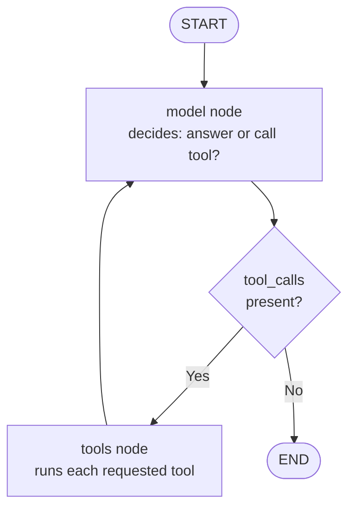

# 01 — Intro to LangChain & a First ReAct Agent — Deep Dive

> Companion to `01_intro.ipynb`. Open this alongside the notebook.

## What you'll learn

- What an **agent** is and how it differs from a one-shot LLM call.
- The **ReAct** loop (Reason + Act) in prose.
- How `create_agent` compiles your tools + system prompt into a runnable state graph.
- How to read the message list that `agent.invoke(...)` returns.

---

## Core concepts

### From "LLM call" to "agent"

A plain LLM call is a function: prompt in, text out. An **agent** wraps that call in a loop and gives it tools. On each iteration the model can either *answer* or *ask to call a tool*. If it asks for a tool, the agent runs the tool, feeds the result back, and asks the model again. The loop terminates when the model produces an answer with no tool requests.

### ReAct: Reason + Act

ReAct is a prompting pattern where the model interleaves **reasoning steps** ("I should look up the weather first") with **action steps** (`get_weather("Seattle")`). LangChain's `create_agent` implements ReAct without you having to write the prompt scaffolding by hand — it just uses the provider's native tool-calling API to express the same loop.



### Why `create_agent` exists

You *can* write this loop yourself (see `03_tools.md`). But once you have multiple tools, retries, or want to add memory / streaming / interruption, the manual code grows fast. `create_agent` produces a compiled state graph with two nodes (`model` and `tools`) and the right edges already wired up.

```python
from langchain.agents import create_agent
from langchain.tools import tool
import requests

@tool
def get_weather(city: str) -> str:
    """Get the current weather for a city using wttr.in."""
    r = requests.get(f"https://wttr.in/{city}?format=3", timeout=5)
    r.raise_for_status()
    return r.text.strip()

agent = create_agent(
    model="google_genai:gemini-2.5-flash",
    tools=[get_weather],
    system_prompt="You are a helpful assistant.",
)
```

`agent` is a `Runnable` — same interface as a chat model. Call `.invoke(...)` to get the final state; call `.stream(...)` to watch events flow through the graph.

---

## Walkthrough of the notebook

### Cell 1: version check

Confirms you're on `langchain` 1.x. The 1.x line is where `create_agent` lives in `langchain.agents`; older 0.x material on the web won't match exactly.

### Cell 2: env loading

`load_dotenv()` reads your `.env` into `os.environ`. This must run **before** `init_chat_model` or `create_agent` because those calls read the API key out of the environment immediately.

### Cell 3: tool + agent definition

Three pieces:
1. `@tool` turns `get_weather` into a `BaseTool` whose JSON schema is derived from the function signature + docstring.
2. `requests.get("https://wttr.in/<city>?format=3")` is a no-auth weather service — `format=3` returns a short line like `Jamnagar: ☀️ +30°C`.
3. `create_agent(...)` compiles the agent. The `model=` string uses the prefix syntax (`provider:model`).

### Cell 4: invoking the agent

```python
response = agent.invoke({"messages": [{"role": "user", "content": "What is the weather like in Jamnagar"}]})
response["messages"][-1].content
```

The input format is a dict with a `messages` key (the agent's state schema). The output is the final state dict; `messages[-1]` is the last message in the list — the model's final `AIMessage` containing the answer.

The full `messages` list looks like:

1. `HumanMessage("What is the weather like in Jamnagar")`
2. `AIMessage(tool_calls=[{"name": "get_weather", "args": {"city": "Jamnagar"}, "id": "..."}])`
3. `ToolMessage(content="jamnagar: ☀️ +30°C", tool_call_id="...")`
4. `AIMessage("The weather in Jamnagar is ☀️ +30°C.")`

That four-step list **is** the ReAct loop, captured.

---

## Common pitfalls

1. **Calling `agent.invoke("hello")` with a string.** The agent expects `{"messages": [{"role": "user", "content": "hello"}]}`. The error is unfriendly — remember the shape.
2. **Forgetting `load_dotenv()`.** You'll get an authentication error that doesn't obviously say "no API key" — it just says "permission denied" from the provider.
3. **Leaving `debug=True` on.** It dumps every graph event to stdout, which buries the actual response. Use it once to learn the shape, then turn it off.
4. **Mismatched provider prefix.** Passing just `"gemini-2.5-flash"` will use Vertex AI by default and may fail with auth errors if you don't have gcloud set up. Use `"google_genai:gemini-2.5-flash"`.
5. **No timeout on `requests.get`.** If the weather API hangs, the agent hangs. Always pass `timeout=`.

---

## Further reading

- [`langchain_theory.md` §6](./langchain_theory.md#6-autonomous-react-agents) — the state-graph view of `create_agent`.
- [`03_tools.md`](./03_tools.md) — what `create_agent` is doing for you under the hood, in raw code.
- Next: [`02_model_integration.ipynb`](./02_model_integration.ipynb) — the three execution patterns (invoke / stream / batch).
