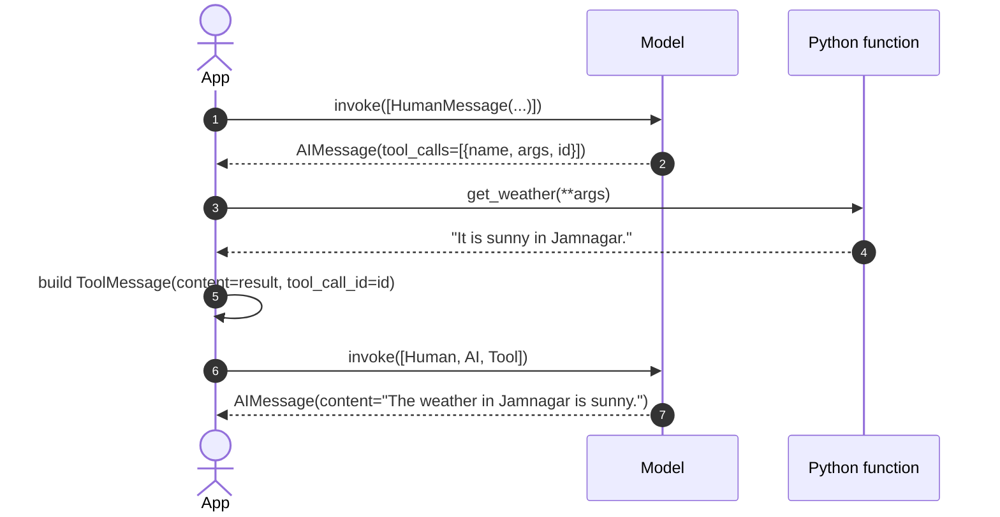

# 03 — Tool Calling: the Raw Mechanics — Deep Dive

> Companion to `03_tools.ipynb`.

## What you'll learn

- How `@tool` builds a JSON schema from a function signature + docstring.
- What `model.bind_tools(...)` actually sends to the provider.
- The three-step manual execution loop, by hand.
- How `tool_call_id` links a request and its result.
- When to drop down to the manual loop instead of using `create_agent`.

---

## Core concepts

### The `@tool` decorator

```python
from langchain.tools import tool

@tool
def get_weather(location: str) -> str:
    """Get the weather at a location.

    Args:
        location: The city and state, e.g. "Jamnagar, Gujarat"
    """
    return f"It is sunny in {location}."
```

The decorator inspects:

| What it reads | What it becomes |
|---|---|
| Parameter type hints (`location: str`) | JSON Schema `type: string` |
| Docstring's first paragraph | Tool description (the model reads this) |
| Docstring `Args:` block | Per-parameter `description` in the schema |
| Function return type | Used in some validation paths; otherwise informational |

The result is a `BaseTool` with three useful attributes:

```python
get_weather.name                            # "get_weather"
get_weather.description                     # "Get the weather at a location.\n..."
get_weather.args_schema.model_json_schema() # full JSON schema dict
```

**The docstring is not optional in practice.** The model decides whether to call the tool based on its description. A bad docstring → a bad call rate. A good docstring is one to three sentences describing what the tool does and when to use it.

### `bind_tools` — making the model aware

```python
model_with_tools = model.bind_tools([get_weather])
```

Two facts about `bind_tools`:

1. **It returns a new model object.** It does not mutate the original. The new model sends the tool schemas with every API request.
2. **It does not let the model run anything.** The model can only *request* a tool call by emitting `AIMessage.tool_calls`. Your application code is responsible for executing the tool.

When the model decides to use a tool, the returned `AIMessage` looks like:

```python
AIMessage(
    content="",                                  # often empty when calling tools
    tool_calls=[
        {
            "name": "get_weather",
            "args": {"location": "Jamnagar"},
            "id": "call_abc123",
            "type": "tool_call",
        }
    ],
)
```

### The manual execution loop



The three steps in code:

```python
messages = [HumanMessage("What's the weather in Jamnagar?")]

# 1. Model produces tool calls
ai = model_with_tools.invoke(messages)
messages.append(ai)

# 2. App executes each tool, appends ToolMessage(s)
for call in ai.tool_calls:
    result = get_weather.invoke(call)   # returns a ToolMessage with matching tool_call_id
    messages.append(result)

# 3. Model sees the results and produces the final answer
final = model_with_tools.invoke(messages)
```

In real loops, step 3 might *itself* return more tool calls — so this becomes a `while ai.tool_calls:` loop. That's exactly what `create_agent` writes for you.

### The `tool_call_id` link

When `get_weather.invoke(call)` runs, it returns a `ToolMessage` whose `tool_call_id` matches `call["id"]`. This identifier is how the model matches the result back to its own request — critical when the model issues multiple parallel tool calls in a single `AIMessage`.

If you build `ToolMessage` by hand (instead of via `tool.invoke(call)`), you must set `tool_call_id` correctly yourself:

```python
ToolMessage(content=tool_result_str, tool_call_id=call["id"])
```

### Parallel tool calls

Many modern providers (OpenAI, Gemini, Claude) emit multiple tool calls in a single `AIMessage` when the user's question demands several independent pieces of data. Example:

> User: "What's the weather in Jamnagar AND the current time in Asia/Kolkata?"

The model returns one `AIMessage` with two entries in `tool_calls`:

```python
[
    {"name": "get_weather", "args": {"location": "Jamnagar"}, "id": "call_1"},
    {"name": "get_time",    "args": {"timezone": "Asia/Kolkata"}, "id": "call_2"},
]
```

Your code iterates both, runs both (potentially in parallel), and appends both `ToolMessage`s before re-invoking the model.

---

## Walkthrough of the notebook

### Cells 1–4: setup + define `get_weather`

Standard pattern: load env, build model, decorate the function. Note the `Args:` block — that's what gives the model the description of the `location` parameter.

### Cell 6: inspect the schema

`get_weather.args_schema.model_json_schema()` shows the schema the model actually sees. Worth eyeballing once — it's just Pydantic JSON schema with descriptions pulled from your docstring.

### Cells 8–10: `bind_tools` and inspect tool_calls

`model_with_tools.invoke(...)` returns an `AIMessage`. Note that `.content` is empty — the model expressed its intent as a structured `tool_calls` entry instead of as natural-language text.

### Cell 12: the three-step manual loop

The whole `create_agent` machinery, in 8 lines:
1. Invoke once → get tool calls.
2. Execute each tool → get `ToolMessage`s.
3. Invoke again → get the final natural-language answer.

### Cell 14: inspecting the message history

Same shape as what `create_agent` produced in notebook 01. Confirms the agent and the manual loop are doing the same work.

### Cell 16: multiple tools

`bind_tools([get_weather, get_time])` lets the model pick. The compound question triggers parallel tool calls. Use this pattern any time the user's question has multiple independent sub-queries.

---

## Common pitfalls

1. **Skipping the `Args:` block in the docstring.** The model can't see what `location` means; tool-call quality drops.
2. **Returning a non-string from a tool.** Tools should return strings (or things that stringify cleanly). The result becomes `ToolMessage.content`, which is then re-encoded into the model's context window.
3. **Forgetting `tool_call_id`.** Hand-rolled `ToolMessage(content="...")` without `tool_call_id` will fail validation. Always copy the `id` from the originating `AIMessage.tool_calls` entry.
4. **Looping forever.** A misbehaving tool can produce a result the model keeps treating as incomplete, causing infinite retries. In a real loop, cap iterations: `for _ in range(max_iters):`.
5. **Mutating `messages` in place across iterations of an experiment.** If you re-run a cell, the old `AIMessage` is still in `messages` and confuses the model. Reset the list at the top of each experiment cell.

---

## Further reading

- [`langchain_theory.md` §5](./langchain_theory.md#5-tool-binding--function-calling) — the same material in conceptual form.
- [`01_intro.md`](./01_intro.md) — what `create_agent` does with this loop.
- Next: [`04_messages.ipynb`](./04_messages.ipynb) — the message schema in detail, including provider-specific metadata.
