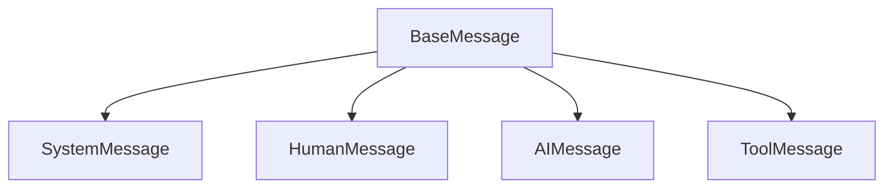

# 04 — Messages: the Fundamental Unit of Context — Deep Dive

> Companion to `04_messages.ipynb`.

## What you'll learn

- The role/content/metadata triad every message carries.
- The four `BaseMessage` subclasses and the responsibility of each.
- Why messages-as-objects beat plain strings once you need history or tools.
- How `tool_call_id` links a request and its response.
- What lives in `response_metadata`, `usage_metadata`, and `additional_kwargs`.
- Provider-specific quirks worth knowing (Groq reasoning, Gemini signatures).

---

## Core concepts

### The triad

Every message — regardless of which class — carries three things:

```
┌──────────────────────────────────────────────────────┐
│ Role     ── encoded by the class                      │
│            (SystemMessage / HumanMessage / AIMessage / │
│             ToolMessage)                              │
│                                                      │
│ Content  ── text OR a list of content blocks          │
│            (e.g. [{"type": "text", ...}, {"type":     │
│             "image_url", ...}])                       │
│                                                      │
│ Metadata ── response_metadata (token usage, finish    │
│            reason, model name)                        │
│            additional_kwargs (provider extras)        │
│            id, name (optional)                        │
└──────────────────────────────────────────────────────┘
```

### Class hierarchy



| Class | Emitted by | Carries | Purpose |
|---|---|---|---|
| `SystemMessage` | You | content (text) | Behaviour, persona, output format. Sits at the start of the list. |
| `HumanMessage` | You / your user | content (text or multimodal blocks) | User input. Optional `name=`, `id=`. |
| `AIMessage` | The model | content + `tool_calls` + `response_metadata` + `usage_metadata` + `additional_kwargs` | The model's response. May contain text, tool requests, or both. |
| `ToolMessage` | Your application | content (the tool's output) + `tool_call_id` | Returns a tool's result to the model. **`tool_call_id` must match** the originating `AIMessage.tool_calls[i].id`. |

### Why messages, not strings?

A plain string "prompt" hides three things you'll always need eventually:

1. **History order and roles.** A conversation is a sequence of `(role, content)` turns. Without the role on each turn, the model can't tell what's user input vs prior reply vs system instruction.
2. **Multimodal content.** An image attached to a user message goes into `HumanMessage.content` as a structured block — there is no plain-string representation.
3. **Tool exchanges.** Tool requests live on `AIMessage.tool_calls` and results live on `ToolMessage.content`, linked by `tool_call_id`. None of that fits in a string.

The string form (`model.invoke("Hi")`) is fine for one-shots — it gets wrapped as a single `HumanMessage` internally. Once you need a system prompt, history, or tools, switch to a list of messages.

### The tool-call link in detail

```
AIMessage.tool_calls = [
    {"name": "get_weather", "args": {...}, "id": "call_abc"},  ──┐
    {"name": "get_time",    "args": {...}, "id": "call_xyz"},  ──┼─┐
]                                                                │ │
                                                                 ▼ │
ToolMessage(content="Rainy, 55°F", tool_call_id="call_abc")  ────  │
                                                                   ▼
ToolMessage(content="2026-05-23 19:00 IST", tool_call_id="call_xyz")
```

The model decides which result answers which request by matching `tool_call_id` strings. If you build `ToolMessage`s by hand and mismatch the ids, the model gets confused — sometimes it'll just guess, sometimes it'll loop asking for the tool again.

### Standard vs provider-specific metadata

| Field | Standard? | What's in it |
|---|---|---|
| `.content` | ✅ standard | The response text (or empty when tool-calling). |
| `.tool_calls` | ✅ standard | List of `{name, args, id}` dicts. |
| `.usage_metadata` | ✅ standard | `{"input_tokens": ..., "output_tokens": ..., "total_tokens": ...}`. |
| `.response_metadata` | ~standard | `{"model_name", "finish_reason", "token_usage": {...}, ...}` — same keys across providers but contents differ slightly. |
| `.additional_kwargs` | ❌ provider-specific | Groq's `reasoning_content`, Gemini's `__gemini_function_call_thought_signatures__`, OpenAI's legacy `function_call`, etc. |

**Rule of thumb**: write production code against the first four; treat `additional_kwargs` as a debugging surface.

---

## Walkthrough of the notebook

### Cell 1–2: setup

Standard `load_dotenv()` then `init_chat_model("groq:qwen/qwen3-32b")`. Groq is chosen so you see `reasoning_content` in `additional_kwargs`.

### Cells 3–5: string vs message list

The string form (`model.invoke("...")`) and the list form (`model.invoke([...])`) both work. They produce the same kind of `AIMessage`. The list form is what you'll use as soon as you need a `SystemMessage` or history.

### Cells 6–7: `SystemMessage`

Two `SystemMessage` examples — a poetry expert and a senior Python developer. Notice how the same `HumanMessage` produces radically different responses based on the system prompt. **The system prompt is the highest-leverage knob in the API.**

### Cells 8–9: `HumanMessage` with optional kwargs

`name=` is for multi-user chats (so the model can attribute messages); `id=` is for your own tracing. Neither is required for typical use.

### Cell 11: anatomy of an `AIMessage`

Inspects the four standard slots: `.content`, `.tool_calls` (empty here), `.additional_kwargs.keys()` (Groq puts `reasoning_content` here), and `.usage_metadata`.

### Cells 13–17: hand-building a tool exchange

The notebook demonstrates the load-bearing detail — you construct an `AIMessage` with a `tool_calls` entry, then a `ToolMessage` with a matching `tool_call_id`, then send both back to the model along with the original `HumanMessage`. The model picks up the implicit "you asked for weather, you got the result" and produces a natural-language answer.

This is exactly what `create_agent` (notebook 01) and the manual loop (notebook 03) do — but stripped down to the raw message objects.

### Cell 19: provider-specific metadata

Pulls back the curtain on `additional_kwargs`. Useful awareness, not application-level code.

---

## Common pitfalls

1. **Mismatched `tool_call_id`.** Most common bug when hand-building tool exchanges. Copy the id verbatim from `AIMessage.tool_calls[i]["id"]`.
2. **Forgetting that `AIMessage.content` is empty during tool calls.** Don't `print(response.content)` and conclude the model gave a blank answer — check `response.tool_calls` first.
3. **Stuffing instructions in the `HumanMessage`.** Persona / format / constraints belong in `SystemMessage`. Putting them on every human turn wastes tokens and is more fragile.
4. **Relying on `additional_kwargs` keys cross-provider.** They differ. If you need a token count, use `usage_metadata` (standard).
5. **Confusing `response_metadata` with `usage_metadata`.** They overlap (`response_metadata["token_usage"]` exists), but `usage_metadata` is the cross-provider-standard cleaner field. Prefer it.

---

## Further reading

- [`langchain_theory.md` §4](./langchain_theory.md#4-message-lifecycle--schema) — message schema in conceptual form.
- [`03_tools.md`](./03_tools.md) — how `tool_call_id` is generated and consumed in a real loop.
- Course complete — see the bottom of [`README.md`](./README.md) for follow-on topics (structured output, RAG, LangGraph, LangSmith).
