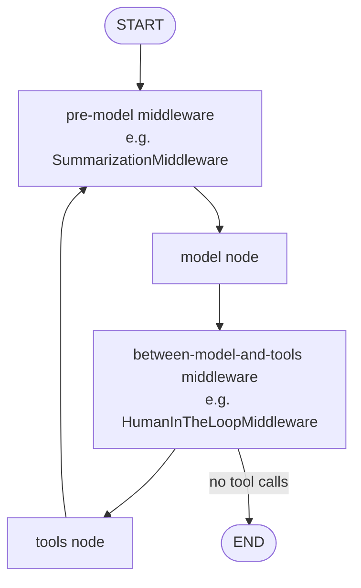

# 06 — Middleware: Intercepting Agent Behaviour — Deep Dive

> Companion to `06_middleware.ipynb`.

## What you'll learn

- What **middleware** is and where it sits in the agent's state graph.
- `SummarizationMiddleware` with its three trigger modes (`messages`, `tokens`, `fraction`).
- `HumanInTheLoopMiddleware` with the three decision types (`approve`, `edit`, `reject`).
- Why a **checkpointer** is required and what `thread_id` does.
- The interrupt/resume pattern: `__interrupt__` in the response + `Command(resume={...})` to continue.

---

## Core concepts

### Where middleware sits

Recall the agent state graph from notebook 01:

```
START → model → (tool_calls?) → tools → model → ... → END
```

Middleware **wraps** the nodes. Different built-ins hook at different points — a summariser inspects the message list *before* the model node fires; a human-in-the-loop guard inspects tool calls *between* the model and tools nodes. From your code's perspective, you just pass `middleware=[...]` to `create_agent` and the wiring is done for you.



### Why checkpointers and thread_id matter

Middleware that pauses (HIL) or accumulates state across calls (summarisation) needs the agent's state to **persist between `.invoke()` calls**. That's what a checkpointer does — it saves the current graph state under a thread id and rehydrates it next time you invoke with the same id.

```python
from langgraph.checkpoint.memory import InMemorySaver

agent = create_agent(
    model="groq:qwen/qwen3-32b",
    checkpointer=InMemorySaver(),   # required for HIL / stateful summarisation
    middleware=[...],
)

config = {"configurable": {"thread_id": "user-42-chat"}}
agent.invoke({"messages": [...]}, config)   # writes state under thread "user-42-chat"
agent.invoke({"messages": [...]}, config)   # picks up where it left off
```

- Same `thread_id` across invokes → one continuing conversation.
- Different `thread_id` → independent conversations, isolated state.
- For production, swap `InMemorySaver` for `SqliteSaver` / `PostgresSaver` so state survives restarts.

---

## Part 1 — `SummarizationMiddleware`

### The problem

Every turn of an agent loop sends the **entire message history** back to the model. After a few dozen turns, you're shipping kilobytes of context per call. Cost scales linearly; latency scales linearly; eventually you hit the context window and crash.

### The solution

`SummarizationMiddleware` watches the message list. When a **trigger** fires, it asks a (typically cheap) summarisation model to compress the oldest messages into a single summary message, and keeps the most recent N messages verbatim so immediate context isn't lost.

```python
SummarizationMiddleware(
    model="groq:qwen/qwen3-32b",         # the summariser model
    trigger=("messages", 10),            # fire when ≥ 10 messages
    keep=("messages", 4),                # keep last 4 verbatim
)
```

### Trigger modes

| Trigger | Semantics |
|---|---|
| `("messages", N)` | Count message objects. Simple; ignores message length. |
| `("tokens", N)` | Count actual tokens. Most accurate. Slightly slower (must tokenise). |
| `("fraction", f)` | Tokens as a fraction of the model's context window. Portable across models with different windows. |

`keep=` uses the same shape — `("tokens", 200)` keeps roughly 200 tokens of recent history.

### Pitfalls

- **Summary loses detail.** If your agent later needs an exact prior datum (a specific number, name, etc.), the summary may have dropped it. For high-stakes recall, store data in a real store (vector DB, structured memory) instead of relying on summary fidelity.
- **Choosing the summariser model.** A cheap model is fine for summaries — `groq:qwen/qwen3-32b` is overkill if you're summarising chit-chat. Smaller, faster models save cost and latency.
- **Trigger too low.** If you summarise after every turn, you spend more on summary calls than you save on context tokens. Tune to your actual conversation length.

---

## Part 2 — `HumanInTheLoopMiddleware`

### The problem

Some tool calls are irreversible or expensive: database writes, payments, outbound emails, deletions. Letting the model fire them silently is a recipe for awkward Monday-morning chat with your incident manager.

### The solution

`HumanInTheLoopMiddleware` intercepts tool calls **before they execute**. The agent returns an `__interrupt__` value, you review the proposed call, then resume with a decision.

```python
HumanInTheLoopMiddleware(
    interrupt_on={
        "send_email_tool": {"allowed_decisions": ["approve", "edit", "reject"]},
        "read_email_tool": False,    # no interrupt — safe to run silently
    }
)
```

### The three decisions

| Decision | Resume payload | Effect |
|---|---|---|
| `approve` | `{"type": "approve"}` | Tool runs with the model's proposed args. |
| `edit` | `{"type": "edit", "edited_action": {"name": "...", "args": {...}}}` | Tool runs with the args **you** provide. |
| `reject` | `{"type": "reject"}` | Tool doesn't run. The agent receives a `ToolMessage` with `status='error'` content like `"User rejected the tool call..."` and continues. |

### The interrupt / resume pattern

```python
from langgraph.types import Command

# Step 1: invoke, hit the interrupt
result = agent.invoke({"messages": [HumanMessage("Send email...")]}, config)

if "__interrupt__" in result:
    # inspect result["messages"][-1].tool_calls to see what the model wants to do
    decision = ask_human_for_decision(result)

    # Step 2: resume with the decision
    result = agent.invoke(
        Command(resume={"decisions": [decision]}),
        config,
    )
```

The agent picks up exactly where it stopped because the checkpointer persisted the state under `thread_id`. Without a checkpointer the resume doesn't work — that's why both middleware require one.

### Pitfalls

- **Forgetting the checkpointer.** Without it, `Command(resume={...})` has no state to resume from. You'll get cryptic errors.
- **Returning `False` for the wrong tools.** A tool set to `False` runs silently. Be deliberate — list the tools you want to skip; default-allow risky ones is dangerous.
- **Treating `reject` like silent failure.** The model **sees** the rejection (as a `ToolMessage` with `status='error'`) and will reason about it. If you don't want that, you may need to end the conversation programmatically instead.
- **Edit args that don't match the tool's schema.** The middleware passes whatever you put in `edited_action.args` to the tool — if it doesn't match the tool's parameters, the tool errors at runtime.

---

## Walkthrough of the notebook

| Section | Cells | Concept |
|---|---|---|
| Setup | 1–3 | `load_dotenv`, assert `GROQ_API_KEY`. |
| 1.1 Message trigger | 5–8 | Trigger by message count; watch count climb past 10, then drop. |
| 1.2 Token trigger | 9–11 | Add a tool that returns big strings; trigger by token count. |
| 1.3 Fraction trigger | 12–13 | Fraction-of-context-window trigger for portability across models. |
| 2.1 HIL approve | 15–18 | Build agent, hit interrupt, inspect, resume with `approve`. |
| 2.2 HIL reject | 19–21 | Resume with `reject`; model reasons about the rejection. |
| 2.3 HIL edit | 22–25 | Resume with `edit`; rewrite args; tool runs with corrected values. |

---

## Common pitfalls (across both middleware)

1. **No checkpointer.** Both middleware require one. The error message isn't always obvious.
2. **Same `thread_id` across experiments.** Old state leaks into new tests. Use distinct thread ids per scenario (`test-approve`, `test-reject`, etc.) or reset between cells.
3. **Re-running a cell that does `agent.invoke(...)` after an interrupt.** Without checking `__interrupt__` first, you'll re-send the prompt instead of resuming, and the state machine gets confused.
4. **Assuming the summariser preserves all detail.** It's a model running on a prompt — it can drop, paraphrase, or hallucinate. For exact recall, store data outside the message list.

---

## Further reading

- [`langchain_theory.md` §7](./langchain_theory.md#7-middleware-intercepting-agent-behaviour) — middleware in conceptual form.
- [`01_intro.md`](./01_intro.md) — the underlying `create_agent` state graph that middleware wraps.
- [`03_tools.md`](./03_tools.md) — the tool-call mechanics that HIL intercepts.
- Beyond this course: **LangGraph** (more flexible state machines), **LangSmith** (tracing & observability).
