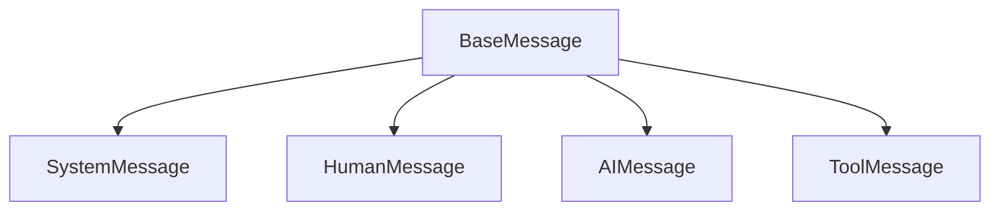
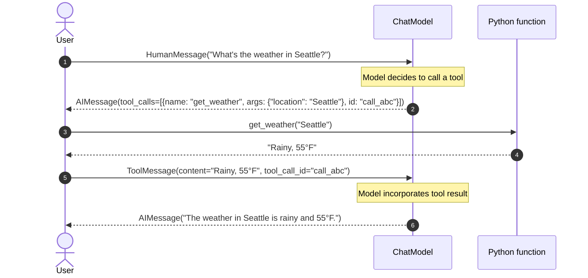
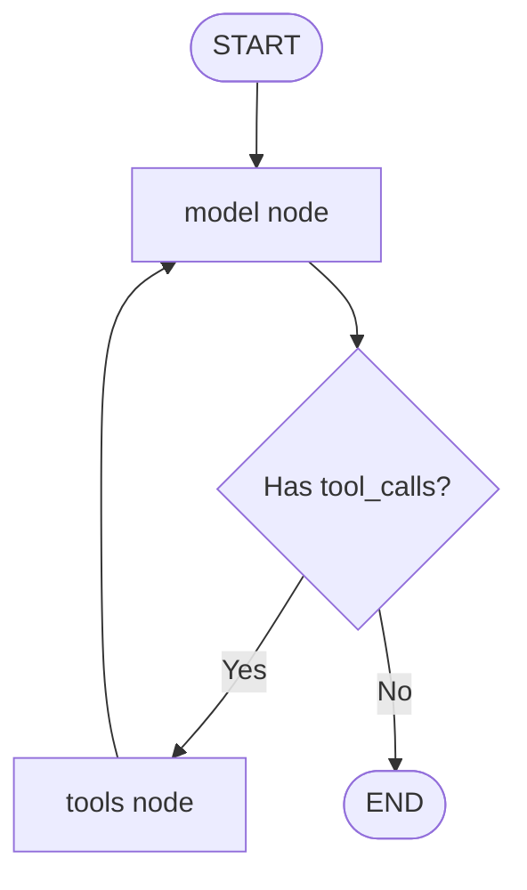
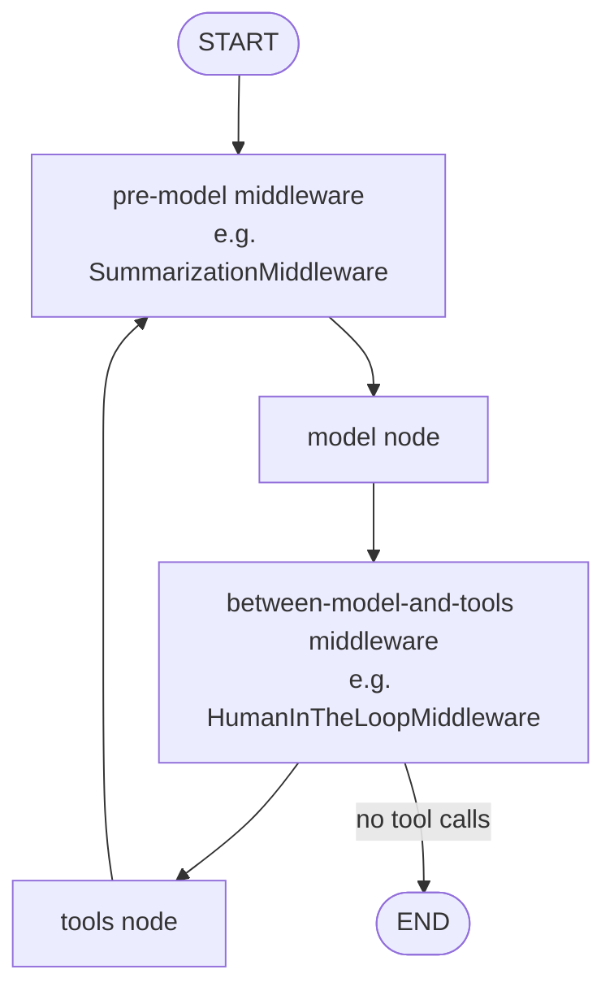

# LangChain Core Concepts & Theory Guide

A conceptual reference for the four notebooks in this folder. Read this top-to-bottom once, then keep it open as a glossary while you work through the notebooks.

> **Reading order**: this file → `01_intro` → `02_model_integration` → `03_tools` → `04_messages`. Each notebook ships with a companion `NN_topic.md` deep-dive.

---

## 1. Why LangChain?

If you call an LLM with `requests.post(...)` directly, four things start hurting after the first prototype:

1. **Provider lock-in.** OpenAI, Anthropic, Google, and Groq each have different request bodies, response shapes, and tool-calling conventions. Swapping providers means rewriting plumbing.
2. **Message plumbing.** A multi-turn chat needs a structured history of who said what, in order, with the right roles. You end up reinventing the same schema badly.
3. **Tool-call loops.** When a model decides to call a function, you have to: parse the structured request, dispatch to your code, capture the result, format it back as a message, and re-send the conversation. Repeat until the model stops asking. This is fiddly to get right.
4. **Agent state.** Once you have tool loops, you also need conversation memory, retries, branching, and graceful termination. The control flow grows quickly.

LangChain is an orchestrator that gives you **one** abstraction for each of these:

| Pain | LangChain primitive |
|---|---|
| Provider lock-in | `init_chat_model("provider:model")` + `BaseChatModel` |
| Message plumbing | `SystemMessage` / `HumanMessage` / `AIMessage` / `ToolMessage` |
| Tool-call loops | `@tool` + `model.bind_tools(...)` + (optionally) `create_agent` |
| Agent state | `create_agent` compiles a state graph that runs the loop for you |

The rest of this document expands each of those primitives.

---

## 2. Unified Chat Model Interface

Every provider's chat model is wrapped in a class that conforms to `BaseChatModel`. That base class promises three methods you'll use constantly: `.invoke()`, `.stream()`, `.batch()` (covered in §3).

### Two ways to construct a model

**Option A — `init_chat_model` factory (recommended for most work).** Takes a `"provider:model"` string or an explicit `model_provider=` kwarg:

```python
from langchain.chat_models import init_chat_model

gemini = init_chat_model("google_genai:gemini-2.5-flash")
qwen   = init_chat_model("groq:qwen/qwen3-32b")
claude = init_chat_model("anthropic:claude-sonnet-4-5")
```

Behind the scenes the factory imports the right package (`langchain-google-genai`, `langchain-groq`, etc.) and returns the provider-specific subclass. You get the unified interface without writing the import yourself.

**Option B — direct class import (when you need provider-specific kwargs).**

```python
from langchain_google_genai import ChatGoogleGenerativeAI

model = ChatGoogleGenerativeAI(
    model="gemini-2.5-flash-lite",
    temperature=0.2,
    max_output_tokens=512,
)
```

Use this when you need fine-grained control (safety settings, generation config, etc.) that the factory doesn't surface.

### Provider prefix cheat-sheet

| Prefix | Package | Notes |
|---|---|---|
| `openai:` | `langchain-openai` | Needs `OPENAI_API_KEY` |
| `anthropic:` | `langchain-anthropic` | Needs `ANTHROPIC_API_KEY` |
| `google_genai:` | `langchain-google-genai` | Gemini via AI Studio. Needs `GOOGLE_API_KEY` |
| `google_vertexai:` | `langchain-google-vertexai` | Gemini via Vertex AI. Needs ADC + project |
| `groq:` | `langchain-groq` | Needs `GROQ_API_KEY`. Very fast, has rate limits |

> ⚠️ **Gemini gotcha**: If you pass just `"gemini-2.5-flash"` with no provider, LangChain currently infers `google_vertexai` and prints a deprecation warning. Always be explicit: `"google_genai:gemini-2.5-flash"`.

→ See `02_model_integration.ipynb` and `02_model_integration.md`.

---

## 3. The Three Execution Patterns

Every chat model exposes the same three execution methods. Pick by latency profile, not by personal taste.

### A. Invoke — single request/response

```python
response = model.invoke("Summarise the French Revolution in 3 bullets.")
print(response.content)
```

Blocks until the full response is generated. Returns one `AIMessage`.

### B. Stream — chunk-by-chunk

```python
for chunk in model.stream("Explain how token streaming works in 3 paragraphs."):
    print(chunk.content, end="", flush=True)
```

Yields `AIMessageChunk` objects as tokens arrive. Useful for chat UIs because the user sees text immediately instead of waiting for the full response.

### C. Batch — concurrent prompts

```python
responses = model.batch(
    ["Why is the sky blue?", "How do planes fly?", "What is quantum computing?"],
    config={"max_concurrency": 5},
)
```

Sends multiple prompts in parallel using a thread pool. `max_concurrency` caps how many run at once — set it below your provider's rate limit.

### Decision matrix

| Use case | Pattern | Why |
|---|---|---|
| Classification, formatting, structured extraction | invoke | One result, no UX benefit from streaming |
| Chat UI, long-form content | stream | Perceived latency drops dramatically |
| Bulk evaluation, data labelling | batch | Parallelism amortises network round-trips |
| Tool-calling agent loop | invoke | The loop needs the full message before deciding next step |

→ See `02_model_integration.ipynb` and `02_model_integration.md`.

---

## 4. Message Lifecycle & Schema

A "prompt" in LangChain is actually a list of messages, not a string. Each message is a structured object with three pieces:

1. **Role** — encoded by the class (`SystemMessage`, `HumanMessage`, …).
2. **Content** — text, or a list of content blocks for multimodal (text + image + audio).
3. **Metadata** — `response_metadata` (token usage, finish reason, model name) and `additional_kwargs` (provider-specific extras like reasoning traces).

### Class hierarchy



| Class | Who emits it | Purpose |
|---|---|---|
| `SystemMessage` | You | Behaviour instructions, persona, guardrails. Sits at the start of the list. |
| `HumanMessage` | You / your user | User input. Can contain text, images, audio (multimodal blocks). |
| `AIMessage` | The model | The model's response. May contain `.tool_calls` instead of (or alongside) `.content`. |
| `ToolMessage` | You (after running a tool) | The result of a tool execution. Must carry `tool_call_id` matching the originating `AIMessage.tool_calls[i].id`. |

### Why messages instead of strings?

- **Multi-turn history**: the model needs to see prior turns in order, with roles attached.
- **Multimodal**: an image goes into `HumanMessage.content` as a structured block — you couldn't express that as a plain string.
- **Tool tracing**: the model must see *its own* prior `tool_calls` and the corresponding `ToolMessage` results, linked by `tool_call_id`, to continue the loop coherently.

### The tool-calling loop



The `tool_call_id` is the load-bearing detail. If you mismatch it, the model can't tell which tool result answers which call, and the loop breaks.

→ See `04_messages.ipynb` and `04_messages.md`.

---

## 5. Tool Binding & Function Calling

To let a model interact with the outside world (databases, APIs, calculators), you **bind** Python functions to it as tools.

### Defining a tool

```python
from langchain.tools import tool

@tool
def get_weather(location: str) -> str:
    """Get the current weather for a specific location.

    Args:
        location: The city and state, e.g. "Seattle, WA"
    """
    return f"It is sunny in {location}"
```

The `@tool` decorator inspects two things:

1. **Type hints on parameters** → parameter types in the JSON schema.
2. **Docstring (function description + Args block)** → tool description + parameter descriptions.

The result is a JSON schema the model can read. You can inspect it: `get_weather.args_schema.model_json_schema()`.

### Binding

```python
model_with_tools = model.bind_tools([get_weather])
```

`bind_tools` returns a new model that, when invoked, includes the tool schemas in the API request. The model is now *aware* of the tool but does not run it — it can only **request** that the tool be run by emitting a `tool_calls` field on its `AIMessage`.

### The manual loop

```python
messages = [HumanMessage("What's the weather in Jamnagar?")]

while True:
    ai_msg = model_with_tools.invoke(messages)
    messages.append(ai_msg)
    if not ai_msg.tool_calls:
        break                                    # model is done
    for call in ai_msg.tool_calls:
        result = get_weather.invoke(call)        # returns a ToolMessage
        messages.append(result)

print(messages[-1].content)
```

This is exactly what `create_agent` (§6) does for you under the hood.

→ See `03_tools.ipynb` and `03_tools.md`.

---

## 6. Autonomous ReAct Agents

Writing the loop above gets tedious once you have multiple tools, retries, or branching logic. `create_agent` builds a compiled state graph that runs it for you.



```python
from langchain.agents import create_agent

agent = create_agent(
    model="google_genai:gemini-2.5-flash",
    tools=[get_weather],
    system_prompt="You are a helpful assistant.",
)

result = agent.invoke({"messages": [{"role": "user", "content": "Weather in Jamnagar?"}]})
print(result["messages"][-1].content)
```

The agent loops between the **model node** (decides what to do next) and the **tools node** (executes the requested tools and appends `ToolMessage`s), exiting when the model returns an `AIMessage` with no `tool_calls`.

### When to drop down to the manual loop

- You need custom retry / fallback / approval steps between tool calls.
- You want to intervene programmatically based on a partial result.
- You're debugging tool-calling behaviour and want full visibility.

For everything else, prefer `create_agent` — less code, fewer footguns.

→ See `01_intro.ipynb` and `01_intro.md`.

---

## 7. Middleware: Intercepting Agent Behaviour

Sometimes you need to change what the agent does **without** rewriting the agent. That's what middleware is for: plug-ins that wrap the state graph at specific points.



You pass middleware to `create_agent`; the wiring is automatic:

```python
from langchain.agents import create_agent
from langchain.agents.middleware import SummarizationMiddleware, HumanInTheLoopMiddleware
from langgraph.checkpoint.memory import InMemorySaver

agent = create_agent(
    model="groq:qwen/qwen3-32b",
    tools=[...],
    checkpointer=InMemorySaver(),
    middleware=[
        SummarizationMiddleware(model="groq:qwen/qwen3-32b", trigger=("messages", 10), keep=("messages", 4)),
        HumanInTheLoopMiddleware(interrupt_on={"send_email_tool": {"allowed_decisions": ["approve", "edit", "reject"]}}),
    ],
)
```

### Two built-ins worth knowing

| Middleware | Purpose | Resume mechanism |
|---|---|---|
| `SummarizationMiddleware` | Auto-compresses long history when a `messages` / `tokens` / `fraction` trigger fires. | None — runs invisibly. |
| `HumanInTheLoopMiddleware` | Pauses before configured tool calls so you can `approve` / `edit` / `reject` them. | `Command(resume={"decisions": [...]})` |

### Why a checkpointer is mandatory

Stateful middleware needs the graph's state to survive across `.invoke()` calls. A **checkpointer** persists state under a `thread_id`; on the next invoke with the same id, the state is rehydrated. `InMemorySaver` is fine for notebooks; production uses `SqliteSaver` / `PostgresSaver`.

```python
config = {"configurable": {"thread_id": "user-42-chat"}}
agent.invoke({"messages": [...]}, config)  # saves under thread "user-42-chat"
agent.invoke({"messages": [...]}, config)  # picks up from saved state
```

### The interrupt / resume pattern

For human-in-the-loop, `agent.invoke(...)` may return early with an `__interrupt__` key. You inspect the pending tool call, decide, and resume:

```python
from langgraph.types import Command

result = agent.invoke({"messages": [HumanMessage("Send email...")]}, config)

if "__interrupt__" in result:
    # show result["messages"][-1].tool_calls to a human
    result = agent.invoke(
        Command(resume={"decisions": [{"type": "approve"}]}),
        config,
    )
```

→ See `06_middleware.ipynb` and `06_middleware.md`.

---

## 8. Provider Map (used in these notebooks)

| Notebook | Provider | Model | Why this provider |
|---|---|---|---|
| `01_intro` | `google_genai` | `gemini-2.5-flash` | Tool calling is solid; the ReAct loop runs cleanly. |
| `02_model_integration` | mixed | qwen-3-32b (Groq) + gemini-2.5-flash + gemini-2.5-flash-lite | The point of the notebook is to show the *same* unified interface across providers. |
| `03_tools` | `groq` | `qwen/qwen3-32b` | Groq returns visible `reasoning_content`, so you can read the model's tool-call thinking. |
| `04_messages` | `groq` | `qwen/qwen3-32b` | Same provider as `03_tools`, so message-flow examples carry over without retraining your eyes. |
| `06_middleware` | `groq` | `qwen/qwen3-32b` | Used both as the agent's primary model and as the summariser inside `SummarizationMiddleware`. |

### Provider-specific quirks to know

- **Gemini Vertex AI**: legacy default for the `gemini-` prefix. Prints a deprecation warning. Use `google_genai:` explicitly to silence it and target AI Studio.
- **Gemini AI Studio (`google_genai`)**: requires `GOOGLE_API_KEY`. Cleaner auth.
- **Groq**: returns a `reasoning_content` field in `AIMessage.additional_kwargs` — the model's chain-of-thought before the answer. Useful for debugging.
- **Groq rate limits**: free tier is tight. If you batch heavily, set `max_concurrency` low (≤5).

---

## 9. Glossary

| Term | Meaning |
|---|---|
| **`BaseChatModel`** | Abstract base every provider wrapper inherits. Defines `.invoke()`, `.stream()`, `.batch()`, `.bind_tools()`. |
| **Runnable** | LangChain's universal "thing you can invoke" interface. Chat models, tools, agents, and chains all implement it. |
| **LCEL** | LangChain Expression Language. The `|` pipe syntax for composing Runnables: `prompt | model | parser`. |
| **Chain** | A linear composition of Runnables. Largely superseded by direct LCEL pipes and agents. |
| **Agent** | A Runnable that loops between model decisions and tool executions until the model is done. |
| **Tool** | A Python callable exposed to the model with a JSON schema generated from its signature and docstring. |
| **Message** | A turn in the conversation. Has a role (class), content, and metadata. |
| **`tool_call_id`** | The string that links an `AIMessage`'s tool request to the `ToolMessage` carrying its result. |
| **`additional_kwargs`** | Provider-specific extras on a message — reasoning traces, safety flags, function-call signatures. |
| **`response_metadata`** | Standard-ish metadata: token usage, finish reason, model name, model provider. |
| **Middleware** | A plug-in that wraps the agent's state graph (e.g. `SummarizationMiddleware`, `HumanInTheLoopMiddleware`). |
| **Checkpointer** | Persists graph state across `.invoke()` calls. Required for stateful middleware. |
| **`thread_id`** | Conversation identifier passed via `config["configurable"]["thread_id"]`. Same id = same conversation. |
| **`__interrupt__`** | Key in the agent's response that signals a pause (used by human-in-the-loop). Resumed via `Command(resume={...})`. |

---

## Where to go next

- **`README.md`** — setup, env vars, learning path overview.
- **`01_intro.ipynb` + `01_intro.md`** — your first ReAct agent.
- **`02_model_integration.ipynb` + `02_model_integration.md`** — invoke / stream / batch in depth.
- **`03_tools.ipynb` + `03_tools.md`** — `@tool`, `bind_tools`, the manual execution loop.
- **`04_messages.ipynb` + `04_messages.md`** — the message schema and how the tool-call link works in practice.
- **`06_middleware.ipynb` + `06_middleware.md`** — middleware: summarisation + human-in-the-loop approval.
